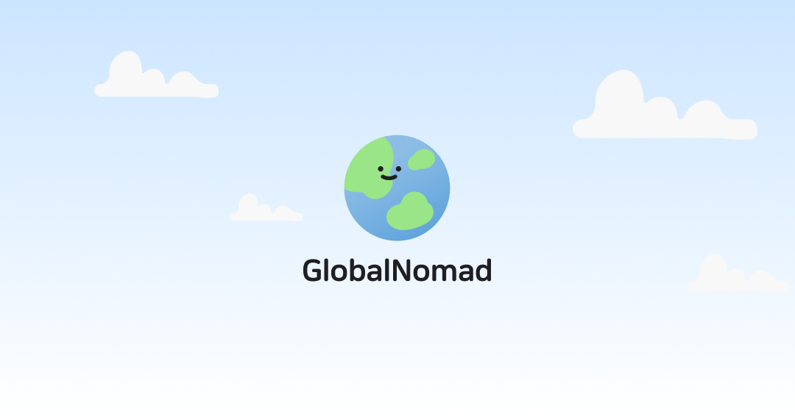

## 🌏 Global Nomad | 글로벌 노마드



### 📌 프로젝트 소개

Global Nomad는 사용자와 호스트를 연결하여 다양한 액티비티를 탐색하고 예약할 수 있도록 돕는 체험 공유 커머스 플랫폼 아키텍처 프로젝트입니다.
단순히 기능을 구현하는 것을 넘어, 확장 가능한 프론트엔드 구조를 설계하고 복잡한 상태 변화를 안정적으로 관리하는 데 목적을 두었습니다.

모달, 캘린더, 드롭다운 등 공통 컴포넌트를 직접 설계하고 API 연동 최적화를 위한 커스텀 훅을 구현하며 프로젝트를 완성했습니다.

[글로벌 노마드 바로가기 ✈️](https://global-nomad-1team.vercel.app/)

---

### 🗓️ 프로젝트 일정

- `프로젝트 기간` : 2025.12.20 ~ 2026.01.19
- `프로젝트 주제 선정 및 진행 계획 수립` : 2025.12.19 ~ 2025.12.20
- `프로젝트 1차 배포` : 2026.01.05
- `프로젝트 2차 배포` : 2026.01.16
- `리팩토링` : 2026.01.12 ~
- `팀 소통 및 일정 관리` : Discord로 소통 **|** GitHub Issue로 진행 상황 파악

---

### 💁 팀원 소개

<table>
  <tr>
    <td align="center"></td>
    <td align="center"></td>
    <td align="center"></td>
    <td align="center"></td>
  </tr>
  <tr>
    <td align="center"><a href="https://github.com/aahreum">이아름</a></td>
    <td align="center"><a href="https://github.com/Jihyun0522">강지현</a></td>
    <td align="center"><a href="https://github.com/looks32">조대원</a></td>
    <td align="center"><a href="https://github.com/chldntjr1321">최우석</a></td>
  </tr>
  <tr bgcolor="#f9f9f9">
    <td align="center"><b>팀장</b> | <code>FE</code></td>
    <td align="center">팀원 | <code>FE</code></td>
    <td align="center">팀원 | <code>FE</code></td>
    <td align="center">팀원 | <code>FE</code></td>
  </tr>
</table>

---

### 🙋 팀원별 역할

---

### 🧑‍💻 기술 스택

#### 라이브러리

       

- 프레임워크 : `Next.js 15.5.9 (App Rotuer)`
- 라이브러리 : `React`
- 개발 언어 : `TypeScript`
- 스타일링 : `Tailwind CSS v4`
- 상태 관리
  - 서버 : `TanStack Query`
  - 클라이언트 : `Zustand`
- UI 컴포넌트 : `Embla Carousel`, `React Toastify`, `React Day Picker`

#### 빌드 & 개발 도구

  

- 패키지 매니저 : `pnpm`
- 컴포넌트 개발 : `Storybook`
- 빌드 엔진 : `Next.js Turbopack`

#### 코드 품질 & 포맷팅

  

- 린트 : `ESLint`
- 포맷팅 : `Prettier`
- 자동화 도구 : `Husky`, `lint-staged`, `Commitlint`

#### 배포 & CI/CD

 

- 프로덕션 배포 : `Vercel`
- CI 워크플로우 : `GitHub Actions` (TypeScript 자동 검사, Chromatic 배포)
- UI 테스트 배포 : `Chromatic` (시각적 회귀 테스트 및 스토리북 배포)

#### 협업 도구

   

- 코드 버전 & 이슈 관리 : `GitHub`
- 팀 소통 : `Discord`
- 문서화 : `Notion`
- 프로젝트 디자인 도안 : `Figma`

### 📦 디렉토리 구조

```
📦src
 ┣ 📂app                  # Next.js App Router 기반 페이지 및 API 라우트
 ┃ ┣ 📂(protected)        # 인증이 필요한 서비스 페이지 (마이페이지, 액티비티 관리 등)
 ┃ ┣ 📂(public)           # 비인증 접근 가능 페이지 (메인, 상세, 로그인/회원가입)
 ┃ ┗ 📂api                # BFF(Backend For Frontend) 패턴을 적용한 API 엔드포인트
 ┣ 📂features             # 도메인별 핵심 비즈니스 로직 및 컴포넌트
 ┃ ┣ 📂auth               # 인증/인가 관련 로직
 ┃ ┣ 📂main               # 메인 페이지 전용 기능
 ┃ ┣ 📂activity-*         # 액티비티 조회/등록/수정 상세 기능
 ┃ ┣ 📂mypage             # 마이페이지 하위 도메인별 관리
 ┃ ┗ 📂notification       # 알림 시스템
 ┣ 📂shared               # 프로젝트 전역에서 재사용되는 공통 자산
 ┃ ┣ 📂apis               # API 통신 계층 (base, bff, feature 서비스)
 ┃ ┣ 📂components         # 공통 UI 컴포넌트 (Design System)
 ┃ ┣ 📂hooks              # 범용 커스텀 훅
 ┃ ┣ 📂stores             # 전역 상태 관리 (Zustand)
 ┃ ┗ 📂types              # 전역 타입 정의
 ┣ 📂stories              # UI 컴포넌트 문서화 및 테스트 (Storybook)
 ┗ 📜middleware.ts        # 라우팅 가드 및 인증 처리
```

---

### ✨ 페이지 기능 소개

##### 🖥️ 메인페이지

<table>
  <tr>
    <td align="center"><b>PC</b></td>
    <td align="center"><b>Tablet</b></td>
    <td align="center"><b>Mobile</b></td>
  </tr>
  <tr>
    <td align="center"></td>
    <td align="center"></td>
    <td align="center"></td>
  </tr>
</table>

##### 🖥️ 검색 결과 페이지

<table>
  <tr>
    <td align="center"><b>PC</b></td>
    <td align="center"><b>Tablet</b></td>
    <td align="center"><b>Mobile</b></td>
  </tr>
  <tr>
    <td align="center"></td>
    <td align="center"></td>
    <td align="center"></td>
  </tr>
</table>

##### 🖥️ 마이페이지 - 내 정보

<table>
  <tr>
    <td align="center"><b>PC</b></td>
    <td align="center"><b>Tablet</b></td>
    <td align="center"><b>Mobile</b></td>
  </tr>
  <tr>
    <td align="center"></td>
    <td align="center"></td>
    <td align="center"></td>
  </tr>
</table>

##### 🖥️ 마이페이지 - 내 예약 내역

<table>
  <tr>
    <td align="center"><b>PC</b></td>
    <td align="center"><b>Tablet</b></td>
    <td align="center"><b>Mobile</b></td>
  </tr>
  <tr>
    <td align="center"></td>
    <td align="center"></td>
    <td align="center"></td>
  </tr>
</table>

##### 🖥️ 마이페이지 - 내 체험 관리

<table>
  <tr>
    <td align="center"><b>PC</b></td>
    <td align="center"><b>Tablet</b></td>
    <td align="center"><b>Mobile</b></td>
  </tr>
  <tr>
    <td align="center"></td>
    <td align="center"></td>
    <td align="center"></td>
  </tr>
</table>

##### 🖥️ 마이페이지 - 내 체험 예약 현황

<table>
  <tr>
    <td align="center"><b>PC</b></td>
    <td align="center"><b>Tablet</b></td>
    <td align="center"><b>Mobile</b></td>
  </tr>
  <tr>
    <td align="center"></td>
    <td align="center"></td>
    <td align="center"></td>
  </tr>
</table>

---

### 🔗 링크

[📜 Notion 문서](https://www.notion.so/ahahahahreum/2c35213dcd4c80a99a16de00a56a8b70?source=copy_link)
[🎨 Figma 디자인](https://www.figma.com/file/of9CO1pQN0XyB5Co2Tkm0E?node-id=29265-11572&p=f&m=dev&type=design)
[🚀 배포 URL](https://global-nomad-1team.vercel.app/)
